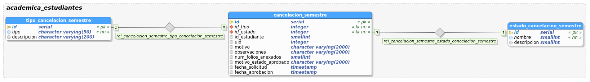

[](https://travis-ci.org/udistrital/cancelacion_semestre_api)

[](https://drone.udistritaloas.edu.co/academica/cancelacion_semestre_api)

# cancelacion_semestre_api

Este es el back-end del proyecto cancelación de semestre, es un API RESTful con la entidades creadas.

Esto trabaja con JWT!!! Es importante cambiarlo ya que no es lo que usan los demás servicios de la OAS.

# REQUERIMIENTOS DE DESARROLLO
-----------------------------
- golang: https://golang.org/doc/install
- beego: http://beego.me/quickstart
- bee: https://github.com/beego/bee#installation
- docker: https://docs.docker.com/engine/installation/linux

Para tener el proyecto localmente se puede ejecutar:

1) Descargar el software a través del método ***go get***:
```bash
go get github.com/juusechec/cancelacion_semestre_api
```
2) Ingresar al directorio del proyecto:
```bash
cd ${GOPATH%%:*}/src/github.com/juusechec/cancelacion_semestre_api
```
GOPATH puede contener más de un directorio, se selecciona el [primero](http://linuxcommand.org/lc3_man_pages/bash1.html).

3) Ejecutar una instancia de ***PostgreSQL*** en ***docker*** y ejecutar el script de generación de la base de datos:
```bash
newgrp docker
docker run -d -p 5432:5432 -e POSTGRESQL_USER=cancelacion_semestre -e POSTGRESQL_PASS=docker -e POSTGRESQL_DB=udistrital orchardup/postgresql
exit
psql -h localhost -d udistrital -U cancelacion_semestre -W < scripts/model/cancelacion_semestre.sql
```
4) Ejecutar el proyecto con ***bee*** y abrir la interfaz de ***swagger*** (swagger-ui) con el que se puede consumir el servicio REST con el navegador deseado:
```bash
bee run -downdoc=true -gendoc=true
xdg-open http://127.0.0.1:8080/swagger/
```
# PRUEBAS UNITARIAS
-------------------
Este proyecto basa las pruebas unitarias en un ejemplo recomendado por el autor de beego https://github.com/goinggo/beego-mgo
en el hilo https://github.com/astaxie/beego/issues/164, un buen artículo para generar test puede ser https://www.goinggo.net/2013/12/sample-web-application-using-beego-and.html

Se necesita instalar:
```bash
go get github.com/goinggo/tracelog
```

Para ejecutar las pruebas se puede hacer:
```bash
go test ./...
```

El front-end del proyecto y las instrucciones de instalación se encuentran en https://github.com/udistrital/cancelacion_semestre_cliente

# MODELO
-------


## Referencias
- https://github.com/udistrital/update_tuleap
